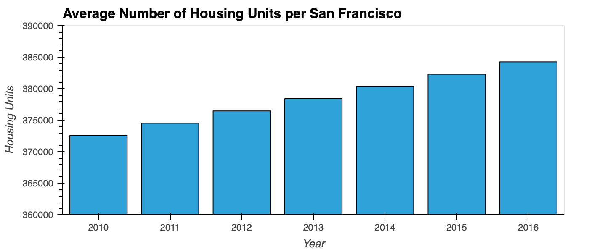
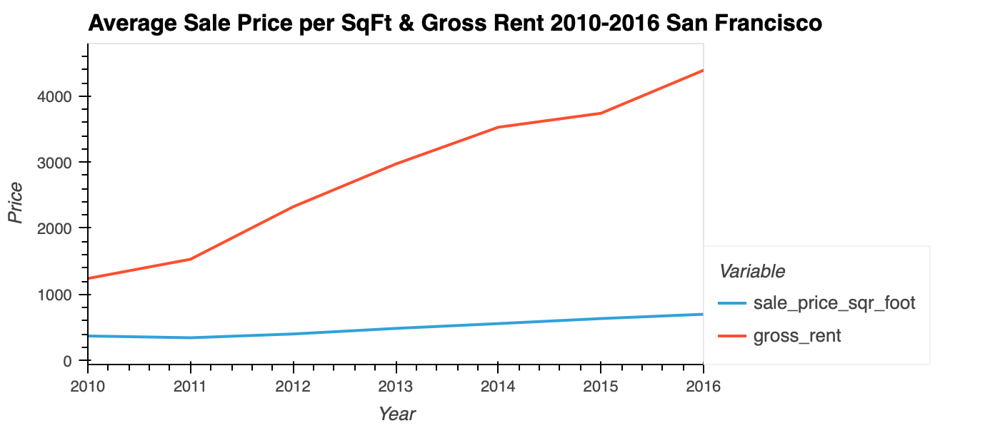
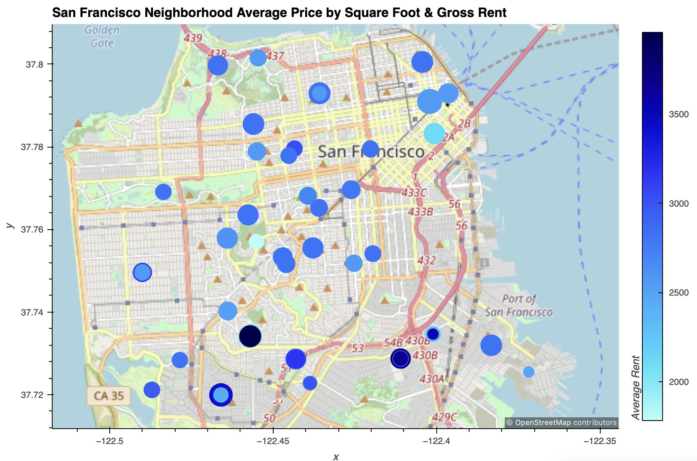

# 06 -  Housing Rental Analysis for San Francisco
### UofT Fintech Bootcamp Assignment by **Juil Yoon**

This project takes real estate data and uses data visualization and geospatial analysis to represent sales price and gross rent across San Francisco neighborhoods.

## Libraries
1. Pandas
2. hvplot
  1. bar
  2. line
  3. point, GeoViews

## Plots Generated Using HoloViews

## Assignment File:
[san_francisco_housing.ipynb](san_francisco_housing.ipynb)

## Notes:
1. Starter code and data provided by UofT Bootcamp.
2. Trouble displaying plots when editing code in VS Code.
3. Trouble with importing `cartopy` when editing code in Anaconda Jupyter Labs.
